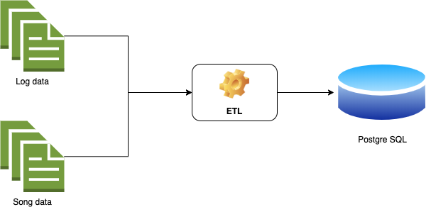

# Million Song Dataset ETL

This is my assignment for the Data Modeling with Postgre SQL Project Submission, which is a part of the Data Engineer Nanodegree.

The scripts contained in this folder parses song and log data from the [Million Song Dataset](http://millionsongdataset.com/) and writes it into a database.



The datamode is following: 


## Files and folders
* `data/log_data` folder contains the log data. 
* `data/song_data` folder contains the song data.
* `create_tables.py` script connects to the database, drops any tables if they exist, and creates the tables for ETL process.
* `sql_queries.py` script contains the SQL queries that are used to create tables, insert data and query information during the ETL process.
* `etl.py` script executes the ETL process.
* `analysis.ipynb` notebook contains data analysis of the extracted data.

## Installation
Before you can run the scripts you need to install a few libraries.
```
$ pip install psycopg2 pandas 
```

## Running the ETL process
Execute the `run_all.sh` script in order to run the ETL process.
```
$ ./run_all.sh
```

## Data analysis
You need Jupyter Lab/Notebook in order to open the data analysis file.
```
$ pip install jupyterlab
$ jupyter lab
```
Jupyter Lab will automatically open up in a new browser tab/window from where you can open up the `analysis.ipynb` notebook.