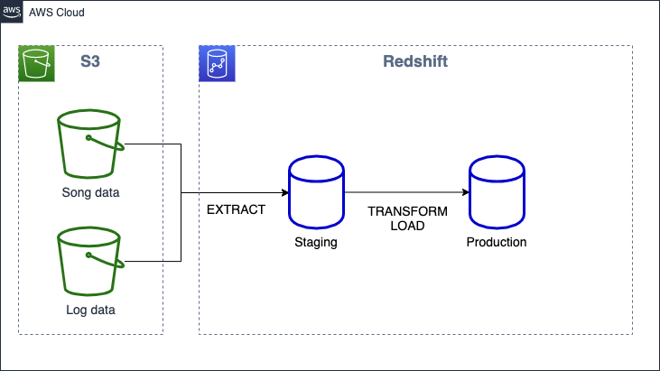
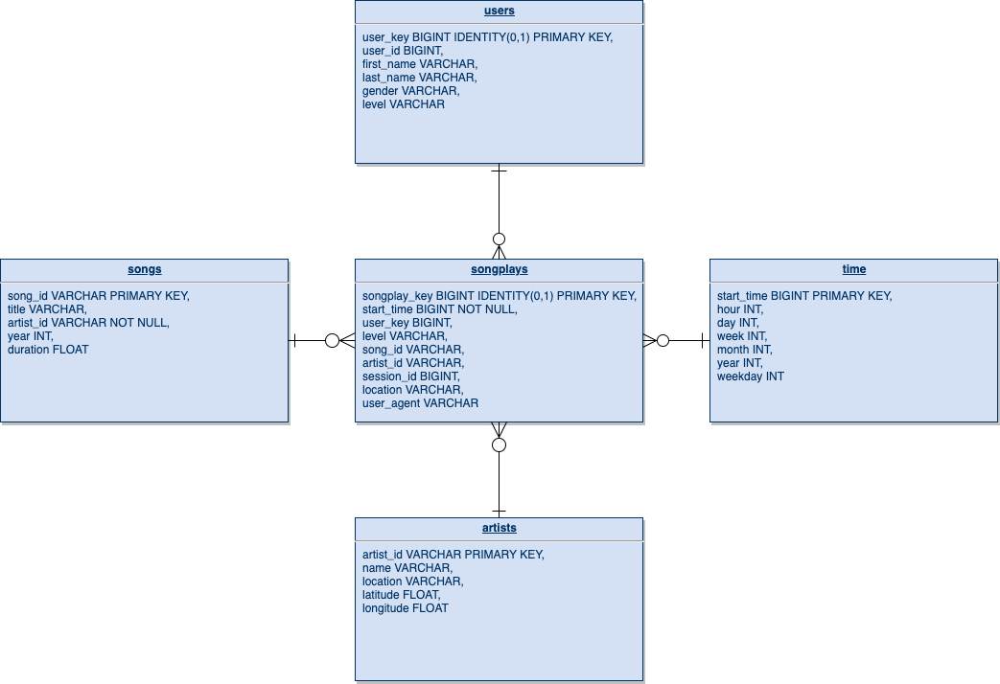

# Sparkify Data Warehouse ETL

This is my assignment for the Data Warehouse Project Submission, which is a part of the Data Engineer Nanodegree.

The scripts contained in this folder create a Amazon Redshift cluster, extracts song and log data from the [Million Song Dataset](http://millionsongdataset.com/) that resides in S3 and writes the results to the database.




The data model is following: 




Motivation for some of the design choices
* I decided to generate a separate user_key. This allows to keep track of slowly chaning dimensions to some extent. E.g. when user changed from free to paid or vice versa.
* The start_time key is an integer generated from the actual date & time (YYYYMMDDHH). I chose this as a design as I consider it to be a more robust primary key than a timestamp. In addition this allows for easy date time queries compared to using epoch ts as a key.
* The staging_events table (not pictured here) has one additional column, compared to the raw data, and contains the the event timestamp. This column is utilized heavily in creation of the time dimension table. I rather do the coversion to TIMESTAMP once rather than for evey column in the time dimension table.


## Files and folders
* `dwh.cfg` configuration file for the ETL process. 
* `cluster_create.py` script creates a cluster, iam roles and opens necessary port for remote access.
* `cluster_delete.py` script deleted the cluster and iam role.
* `cluster_helpers.py` contains utility functions that support cluster creation and deletion.
* `sql_queries.py` script contains the SQL queries that are used to create tables, insert data and query information during the ETL process.
* `create_tables.py` script creates the needed tables for running the ETL process.
* `etl.py` script executes the ETL process.

## Installation
The cluster creation script uses the boto3 library and the ETL script relies on the psycopg2 library, These need to be installed before you can run the scripts.
```
$ pip install psycopg2 boto3
```

## Create cluster using script

Before the ETL process can be run we need a cluster to run it on. This project comes equipped with a script that makes the necessary changes for you in AWS. 
Running the script requires that you have created and IAM role with sufficient privileges to read from a S3 bucket, manage EC2 and Redshift instances as well as create IAM roles.
For demonstration/testing purposes the most straightforwad way is to go https://console.aws.amazon.com/iam/home#/users and create a new user with `AdministratorAccess` managed policy.
**Note**: This is a major security risk if your credentials are compromised and should not be done for long-term use. Delete the role once you're ready testing or create a role with specific access rights needed to run this demo

Once you have created the role copy the key and secret to *dwh.cfg* under the `AWS`section.

It might also be good to fine-tune the `CLUSTER` settings to your liking. **Note** It is recommended to run the cluster in the default region since that's where the source file reside.

You need to fill in database settings, because the database will be created at the same time. Have a look at the *ETL configuration* section further down the page for more details.

Finally run the following command to create the cluster.
```
$ python create_cluster.py
```

Once the cluster creation finishes successfully you need to copy the `DB.HOST` and `IAM_ROLE.ARN` configuration parameters to the *dwh.cfg* configuration file.

## ETL configuration
Database configuration settings and authentication credentials need to correspond to your environment for the ETL process to succeed.

Fill in all settings under the `DB` and `IAM_ROLE` sections.

## Running the ETL process
Execute the `run_all.sh` script in order to run the ETL process. You need to ensure that you can execute the script as well you can do that by running `chmod +x run_all.sh`.
```
$ ./run_all.sh
```

## Data analysis
I have created a simple Tableau Workbook to show some of the data. You can access it from [my Tableau Public profile](https://public.tableau.com/views/Sparkify-aUdacityDataEngineeringNanodegreeproject/Dashboard1?:display_count=y&publish=yes&:origin=viz_share_link).

## Cleaning up
It is recommended to always deleted the cluster when you're done testing as it might otherwise cause unexepted costs that you will have to pay.
Run the `cluster_delete.py` script to delete the cluster and related stuff automatically.
```
$ python cluster_delete.py
``` 

If you want to be 100% certain that everything is deleted, go to the AWS console to double check. **Note** Ensure that you're in the correct region when doing this. ;)