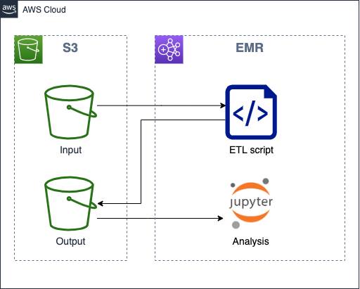
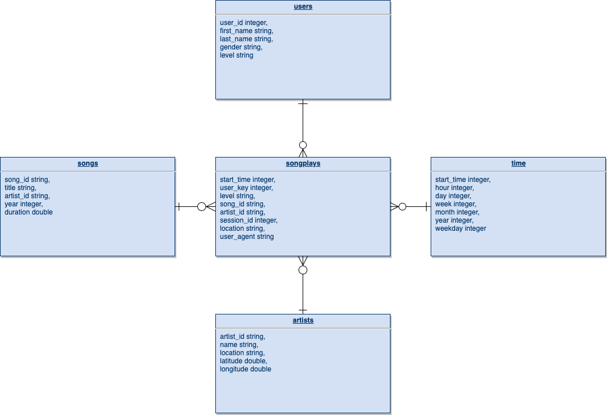

# Sparkify Data Lake

This is my assignment for the Data Lake Project Submission, which is a part of the Data Engineer Nanodegree.

The script contained in this folder extracts song and log data from the [Million Song Dataset](http://millionsongdataset.com/) that resides in S3 and writes the results  back to S3 for analysis.

## Project background

A music streaming startup, Sparkify, has grown their user base and song database even more and want to move their data warehouse to a data lake. Their data resides in S3, in a directory of JSON logs on user activity on the app, as well as a directory with JSON metadata on the songs in their app.

The task was to build an ETL pipeline that extracts their data from S3, processes them using Spark, and loads the data back into S3 as a set of dimensional tables. This will allow their analytics team to continue finding insights in what songs their users are listening to.




## Database schema

### Schema of the input data 

**Song dataset**

```
root
 |-- artist_id: string
 |-- artist_latitude: double
 |-- artist_location: string
 |-- artist_longitude: double
 |-- artist_name: string
 |-- duration: double
 |-- num_songs: long
 |-- song_id: string
 |-- title: string
 |-- year: long
```

**Songs dataset**

```
root
 |-- artist: string
 |-- auth: string
 |-- firstName: string
 |-- gender: string
 |-- itemInSession: long
 |-- lastName: string
 |-- length: double
 |-- level: string
 |-- location: string
 |-- method: string
 |-- page: string
 |-- registration: double
 |-- sessionId: long
 |-- song: string
 |-- status: long
 |-- ts: long
 |-- userAgent: string
 |-- userId: string
```

### Schema of the output data



* The data model follows a star schema, similar to the one in the old data warehouse. This allows the analaysts to rewrite and run thei queries against the data lake with minimal effort.
* The start_time column is as integer generated from event timestamp and follows the following format YYYYMMDDHH. Whereas there is less benefit of this type of key in the context of data lakes I still think it is an elegant solution for filtering data by date efficiently in SQL queries.
* The output data is using parquet format and is partitioned in the following way
 * `songs` are partitioned by *year*, *artist_id*
 * `artists` are not partitioned
 * `users` are not partitioned
 * `time` is partitioned by *year*, *month*
 * `songplays` are partitioned by *year*, *month*

## ETL flow


## Files and folders
* `dl.cfg` configuration file for the ETL process. 
* `etl.py` script executes the ETL process.

## Pre-requisites

It is expected that the user of this script is familiar with AWS service. The follwing items need to be done for the ETL process to succeed.

* IAM user with sufficient privileges administer EMR cluster
* EC2 key pair to use for authentication in code
* EMR cluster running Spark 
* S3 bucket where output data is written

## ETL Configuration
* Add `AWS_ACCESS_KEY_ID` and `AWS_SECRET_ACCESS_KEY`
* Add `OUTPUT` S3 bucket

## Running the ETL process
* You have valid pem file for authentication (expected to reside in you home dir)
* Navigate to https://console.aws.amazon.com/elasticmapreduce to get SSH connection string

Execute the following steps to move script files to the cluster, connect to the cluster, install dependencies and finally run the ETL process
```
$ cd /path/to/project
$ scp dl.cfg etl.py hadoop@<Master public DNS of your cluster>:~/
$ ssh <SSH connection string of your cluster>
$ sudo pip install configparser
$ /usr/bin/spark-submit etl.py
```

## Data analysis
The `spark-analytics.ipynb` Notebook works as an example on how to get started analyzing the data. Please note that the Notebook has been set-up to run in AWS EMR Notebooks environment as PySaprk notebook and as such might require modifications in case you use another Jupyter server.

## Cleaning up
It is recommended to always delete the cluster when you're done testing as it might otherwise cause unexepted costs that you will have to pay. It is also be a good idea to remove the IAM role and EC2 key pair.
