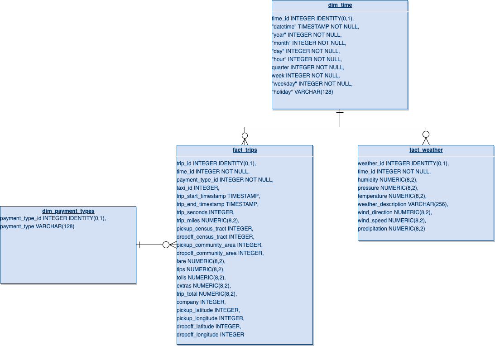
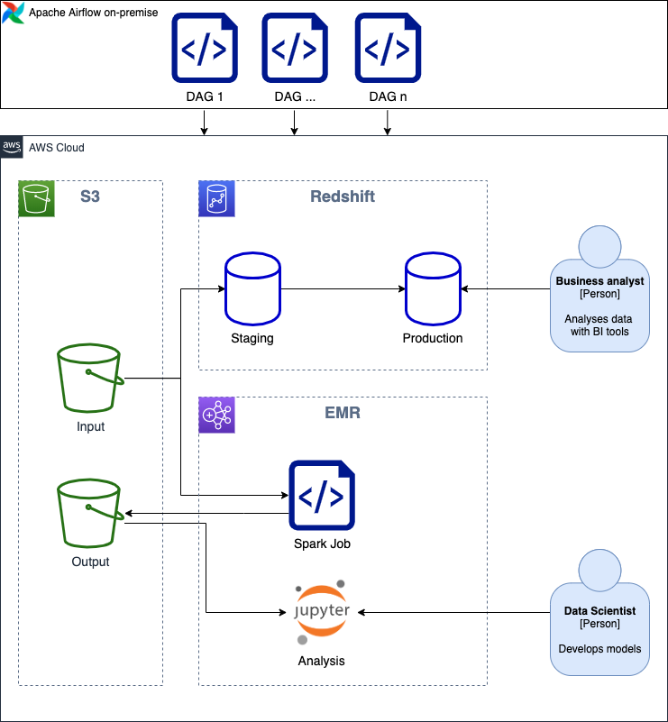
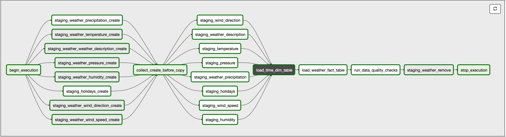
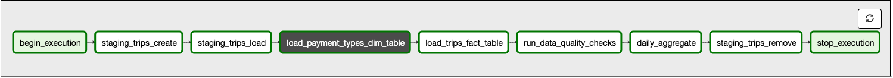

# Capstone project: Taxi rides in Chicago
This is my capstone project submission for the Udacity Data Engineer Nanodegree.

## 1. Scope the project and gather data
For my project I wanted to prioritize data set size over emphasize the size rather than focus on finding the perfect data model. I looked for several options but eventually settled on Chicago Taxi rides as my main dataset. 

**Project Scenario**

You work for a taxi company and with the prevalence of Uber and other Mobility as as Service providers the competition is stiff. You're asked to build a data pipeline to analyse the taxi rides in your city. More specifically your task is to build the pipeline to cater the needs for both business analysts as well as data scientists. The city of Chicago provides a data set of all taxi rides in the city. This is a good starting point for analysis. In addtion, the management team wants you to connect this data to weather information to see what kind of connections there could be found.

### Scope
The definition of project scope is two-fold:
1. Build a data pipeline for data analysts
1. Build a data preparation spark job for data scienctists

#### Data pipeline for reporting and analysis
The first target is to create a data pipeline to provide data for visualization and insights. The data model needs to be easy to work with in Business Intelligence tools.

#### Data preparation spark job for data science
The second target is to create a data spark job to prepare the dataset for machine learning. The data is in such format that it can be fed to hypothecial models from which we'd gain additional insights.

### Data sources
The Taxi trips in Chicago dataset did not contain too much additional information. In order to enrich the data, I looked for related information. I found two different data sources with weather information from Chicago and that had the same time period. In addition, I fetched the US public holidays to provide additional information how holidays might affect the use of Taxi as means of transportation.

It would have been interesting to see similar statistics from e.g. Uber at the same time period and city, but I was unable to find that.

#### Taxi rides
My main data source for this project is Chicago Taxi Rides from 2016. It is available on [Kaggle](https://www.kaggle.com/chicago/chicago-taxi-rides-2016).

Other useful links that provide more details about the data:
* [Chicago Data Portal - Taxi Trips](https://data.cityofchicago.org/Transportation/Taxi-Trips/wrvz-psew)
* [Chicago Digital - Chicago Taxi Data Released](http://digital.cityofchicago.org/index.php/chicago-taxi-data-released)

#### Weather
Weather data was also found on Kaggle ([Historical Hourly Weather Data 2012-2017](https://www.kaggle.com/selfishgene/historical-hourly-weather-data)). It originates from the [OpenWeatherMap](https://openweathermap.org/) service and provides hourly weather information such as temperature, humidity, and wind. 

#### Precipitation
Precipitation data for this location and time period was hard to come by. In the end I found [Daily Temperature and Precipitation Reports](https://www.climate.gov/maps-data/dataset/daily-temperature-and-precipitation-reports-data-tables) from the NOAA website. Unfortunately the granularity of this data is higher than the other data, but it was the best I could find. There was also data with finer grain, but the data was too old.

#### US Holidays
My final data source was to list the US holidays for 2016. These were available in a convenient format [here](https://gist.github.com/shivaas/4758439).

## Step 2: Explore and Assess the Data
For the exploratory data analysis I used Python and Jupyter Notebooks. The main target with my data analysis was to analyse the schema of the source data, get a grasp of how to link the data together, and evaluate how to handle missing data. As an end result I have a clear picture of how the data can be modeled.

The following sub-sections summarize my findings. More detailed information about the steps I carried out can be read from the notebook files that I have linked to in the sub-sections below. 

### Taxi rides
* In order to retain anonymity the dataset did not contain that much valuable information extract into dimension tables.
* Furthermore, this resulted in several null values that complicates this issue further.
* The data has been partitioned into separate files per month. 

LINK TO NOTEBOOK

### Weather
* The data itself is clean and is free from missing values.
* Each weather attribute is separated into own files.
* Each location is separater into own columns.
* The temperature unit is in Kelvin and needs to be converted into Fahrenheit.

LINK TO NOTEBOOK

### Precipitation
* Precipitation data has location information as a station id.
* A separate file contains a list of available stations
* The weather station data is in text format and needed a customer parser (although it was a simple one)
* These need to be joined and filtered in order to find weather stations in Chicago
* One weather station contained precipitation data for every day of 2016

LINK TO NOTEBOOK

## Step 3: Define the Data Model
The data sets turned out to be a bit underwhelming in terms of data modeling. The figure below outlines the final data model:



**fact_trips**
* There were very few dimesions to extract from the taxi rides data partly due to retaining anonymity in the dataset.
* Those columns that could be considered dimensionsional data contained many null values and were of numerical type.
* These numeric identifiers e.g. census tract and community area could even be considered id values if one would get a hold of additional data related to these fields.
* The taxi rides fact table is on a record level granularity
* From ETL point of view, the only thing that is required is to join the time and payment type dimensions to get the correct id's for the dimension table records.

**fact_weather**
* The weather data was merged into one fact table with hourly granularity.
* Since the precipitation data's grain was on daily level I decided to put the daily vailue to 00 hour for each day, keeping the remaining 23 hours of the day with a null value. This way aggregation of data works in the same manner for each column in the weather table.
* Precipitation data is thus included by doing a left join on the other weather data. In addition we filter the data to join with s sub-query so that it only includes the chosen weather station from Explore phase.
* All other weather data is joined by yeare, month, day and hour.
* Temperature data is converted from Kelvin to Fahrenheit at this stage.

**dim_time**
* Time data was separated into its own dimension table with hourly granularity. This is sufficient for any type of aggregations one would like to do with the data.
* I decided to keep the start and end times for the taxi rides in order to keep more precise time information than what is available in the time dimensions table.
* Time dimension is created from the weather data and not the taxi rides data. The motivation for this is that we already know that it is one year's (specifically 2016) data and the timestamp field is clean and on correct granualar level in the weather data. 
* In addition to the common attributes that are usually extracted to a time dimensional table i included hour data as it is the finest grain (excluding precipitation). 
* Another attribute I included were the holidays. I kept them in textual format instead of using a boolean flag, because is allows us to make queries for a specific holiday in a user friendly way.

**dim_payment_types**
* I ended up separating the payment type column into a dimension table for the sake of getting practice and because I did not want to have textual data in the taxt rides fact table.

## Step 4: Run ETL to Model the Data

### ETL pipeline
Architectural overview:



The pipeline consists of 3 separate DAG's:
1. Create tables, which creates the tables used in production environment.
1. Weather ETL, which extracts, transforms, and loads weather and time data.
1. Trips ETL, which extract, transforms, and loads taxi trip and payments data.

General design decisions:
* I decided to use Apache Airflow as a local installation using Docker. Amazon Elastic Beanstalk could be used if you want to run everything in the cloud.
* I had a local Spark installation with Jupyter Lab for local development and used it to work with subsets of the data.
* I chose Amazon Redshift as a data warehouse as it is scalable and widely supported.
* The data set for machine learning is stored on Amazon S3 in parquet format, as it is a cost-effective solution and read is not a top priority in this use case.
* Source data is copied to a S3 bucket, which is used as starting point for the ETL.
* Data science jobs can be run on Amazon EMR, either as spark jobs or Jupyter notebooks.
* Staging tables are created and removed on each DAG run.
* Path to source data is stored in an Airflow variable.

#### Create tables
The ETL jobs creates the following tables:
* `dim_time`
* `dim_payment_types`
* `fact_weather`
* `fact_trips`
* `fact_trips_daily`

#### Weather ETL


* I decided that it is sufficient to include hard coded weather station id in the SQL query when extracting precipitation data.
* I decided that it is acceptable to have hard coded date range as we focus solely on the year 2016.
* Queries for creating staging tables is done using Jinja templating.
* Input filepath is read from an Airflow Variable.
* Validation checks that the length of both of the tables are equal to 366 days x 24 hours.

#### Trips ETL


* DAG is run with a monthly schedule interval.
* File path is dynamically generated from Airflow Variable and Macros.
* Separate staging tables are created for each input file to support parallel execution.
* Data is aggregated on daily level to a separate table to allow better performing BI reports where indiviaul trips are not analysed.

### Data dictionary

**fact_trips**
col_name | col_type | col_num | col_mode | description
---|---|---|---|---
trip_id | integer | 1 | required | Unique identifier for the trip.
time_id | integer | 2 | required | Unique identifier of related record in time table.
payment_type_id | integer | 3 | required | Unique identifier of related record in payment type table.
taxi_id | integer | 4 | nullable | A unique identifier for the Taxi.
trip_start_timestamp | timestamp without time zone | 5 | nullable | When the trip started rounded to the nearest 15 minutes. 
trip_end_timestamp | timestamp without time zone | 6 | nullable | When the trip ended rounded to the nearest 15 minutes. 
trip_seconds | integer | 7 | nullable | Time of the trip in seconds.
trip_miles | numeric(8,2) | 8 | nullable | Distance of the trip in miles.
pickup_census_tract | integer | 9 | nullable | The Census Tract where the trip began. For privacy, this Census Tract is not shown for some trips.
dropoff_census_tract | integer | 10 | nullable | The Census Tract where the trip ended. For privacy, this Census Tract is not shown for some trips.
pickup_community_area | integer | 11 | nullable | The Community Area where the trip began.
dropoff_community_area | integer | 12 | nullable | The Community Area where the trip ended.
fare | numeric(8,2) | 13 | nullable | The fare for the trip.
tips | numeric(8,2) | 14 | nullable | The tip for the trip. Cash tips generally will not be recorded.
tolls | numeric(8,2) | 15 | nullable | The tolls for the trip.
extras | numeric(8,2) | 16 | nullable | Extra charges for the trip.
trip_total | numeric(8,2) | 17 | nullable | Total cost of the trip, the total of the fare, tips, tolls, and extras.
company | integer | 18 | nullable | The taxi company.
pickup_latitude | integer | 19 | nullable | The latitude of the center of the pickup census tract or the community area if the census tract has been hidden for privacy.
pickup_longitude | integer | 20 | nullable | The longitude of the center of the pickup census tract or the community area if the census tract has been hidden for privacy.
dropoff_latitude | integer | 21 | nullable | The latitude of the center of the dropoff census tract or the community area if the census tract has been hidden for privacy.
dropoff_longitude | integer | 22 | nullable | The location of the center of the dropoff census tract or the community area if the census tract has been hidden for privacy.

**fact_trips_daily**
col_name | col_type | col_num | col_mode | description
---|---|---|---|---
datetime | date | 1 | not null | Date of the day.
year | integer | 2 | not null | Year of the day.
month | integer | 3 | not null | Month of the day.
day | integer | 4 | not null | Day of the day.
trip_amount | integer | 5 | nullable | Total amount of trips for the day.
trip_duration_min | numeric(8,2) | 6 | nullable | Minimum trip duration for the day.
trip_duration_avg | numeric(8,2) | 7 | nullable | Average trip duration for the day.
trip_duration_max | numeric(8,2) | 8 | nullable | Maximum trip duration for the day.
trip_duration_sum | numeric(12,2) | 9 | nullable | Total trip duration for the day.
trip_miles_min | numeric(8,2) | 10 | nullable | Minimum trip distance for the day.
trip_miles_avg | numeric(8,2) | 11 | nullable | Average trip distance for the day.
trip_miles_max | numeric(8,2) | 12 | nullable | Maximum trip distance for the day.
trip_miles_sum | numeric(12,2) | 13 | nullable | Total trip distance for the day.
trip_cost_min | numeric(8,2) | 14 | nullable | Minimum trip cost for the day.
trip_cost_avg | numeric(8,2) | 15 | nullable | Average trip cost for the day.
trip_cost_max | numeric(8,2) | 16 | nullable | Maximum trip cost for the day.
trip_cost_sum | numeric(12,2) | 17 |  nullable | Total trip cost for the day.

**fact_weather**
col_name | col_type | col_num | col_mode | description
---|---|---|---|---
weather_id | integer | 1 | required | Unique identifier of the weather record.
time_id | integer | 2 | required | Unique identifier of related record in time table.
humidity | numeric(8,2) | 3 | nullable | Recorded humidity in percent.
pressure | numeric(8,2) | 4 | nullable | Recorded air pressure in hPa.
temperature | numeric(8,2) | 5 | nullable | Recorded temperature in Fahrenheit
weather_description | character varying(256) | 6 | nullable | Textual description of the weather
wind_direction | numeric(8,2) | 7 | nullable | Recorded wind direction in degrees.
wind_speed | numeric(8,2) | 8 | nullable | Recorded wind speed in m/s.
precipitation | numeric(8,2) | 9 | nullable | Recorded precipitation in tenths of mm.

**dim_time**
col_name | col_type | col_num | col_mode | description
---|---|---|---|---
time_id | integer | 1 | required | Unique identifier of the time record.
datetime | timestamp without time zone | 2 | required | Timestamp of the time record.
year | integer | 3 | required | Year of the time record.
month | integer | 4 | required | Month of the time record.
day | integer | 5 | required | Day of the time record.
hour | integer | 6 | required | Hour of the time record.
quarter | integer | 7 | required | Quarter number of the time record.
week | integer | 8 | required | Week numner of the time record.
weekday | integer | 9 | required | Day of week of the time record.
holiday | character varying(128) | 10 | nullable | Holiday name where applicable.

**dim_payment_types**
col_name | col_type | col_num | col_mode | description
---|---|---|---|---
payment_type_id | integer | 1 | required | Unique identifier of the payment type.
payment_type | character varying(128) | 2 | nullable | Payment type.

### Running the pipeline

#### AWS setup
It is expected that the user is familiar with AWS service. The follwing items need to be done for the ETL process to succeed.

* IAM user with sufficient privileges administer EMR cluster
* EC2 key pair to use for authentication in code
* S3 bucket where input and output data is written
* Redshift cluster (allow external connections) 
* EMR cluster running Spark (use SSH tunneling to the cluster from your Airflow instance)
* Copy the source datasets into your bucket

#### Airflow setup
You can spin up an Airflow environment in Docker in case you don't have a ready Ariflow environment to use.
* Install [Docker](https://www.docker.com/)
* Install [Docker Compose](https://docs.docker.com/compose/install/)
* Go to the docker folder in project `$ cd docker`
* Run `$ mkdir pgdata` in the docker folder of this project to persist Airflow data such as connections, variables and history
* Run `$ docker-compose up` in the docker folder of this project to start the environment
* Run `$ docker-compose down` in the docker folder of this project to stop the environment

#### Airflow Connections
* Add `aws_credentials` connection
  * Conn Type: Amazon Web Services
  * Login: `<YOUR AWS KEY>`
  * Password: `<YOUR AWS SECRET>`
* Add `redshift` connection
  * Conn Type: Postgres
  * Host: `<URL TO YOUR REDSHIFT CLUSTER>`
  * Schema: `<NAME OF YOUR DATABASE>`
  * Login: `<YOUR DB USERNAME>`
  * Password: `<YOUR DB PASSWORD>`
  * Port: 5439

#### Airflow Variables
Create a key called `taxi_etl` with val
```
{
"s3_taxi_dir_path":"s3://your-bucket/chicago-taxi-rides-2016",
"s3_precip_file_path":"s3://your-bucket/ghcnd/2016",
"s3_weather_dir_path":"s3://your-bucket/historical-hourly-weather-data",
"s3_holidays_file_path":"s3://your-bucket/US-Bank-holidays.csv"
}
```

#### ETL execution
The DAG's have been configured to start automatically once they are enabled. The first time you run the DAG's you need to pay attention to DAG execution order. The DAG's have been scheduled to run automatically when enabled so you're best off enabling one DAG at a time and waiting for each to finish successfully before enabling the next DAG.

This is one clear place for improvement, but due to time restrictions I decided that this is a good enough solution for now.

### Spark Job
For the capstone project I settled on developing a Spark script instead of integrating the whole execution to Airflow. This seemed like [too big task](https://aws.amazon.com/blogs/big-data/orchestrate-big-data-workflows-with-apache-airflow-genie-and-amazon-emr-part-1/) for this project considering everything else that has already been done.

The Spark part consists of two files in the *spark* folder:
* `data-preparation.ipynb` that takes a narrative approach how the script was created.
* `data_prep.py`, which is the actual job that will be executed on the EMR cluster.

#### Sparkjob execution
* Spin up your EMR cluster
* You need to have a valid pem file for authentication (expected to reside in you home dir)
* Open SSH tunnel to the cluster from your computer that will execute the spcript
* Navigate to https://console.aws.amazon.com/elasticmapreduce to get the SSH connection string

Execute the following steps to move script files to the cluster, connect to the cluster, install dependencies and finally run the ETL process
```
$ cd /path/to/project/spark
$ scp data_prep.py hadoop@<Master public DNS of your cluster>:~/
$ ssh <SSH connection string of your cluster>
[hadoop]$ /usr/bin/spark-submit data_prep.py
```

## Step 5: Complete Project Write Up
This concludes my capstone project. Here's a summary of the project.

### Results
* I have successfully set up a data pipeline in Apache Airflow that exctracts data from S3, performs transformations and writes the results in a dimensional model to a Amazon Redshift data warehouse
* Three of the datasets contained over 1 million rows each. The final trips data contains nearly 20 million rows of data. The ETL performs reasonably well and considerations have been taken while designing and implementing the data pipelines.
  * Taxi trips are read by partition and appended to the final dataset
  * Aggregations are done from the staging data and appended to the final dataset
  * ETL pipelines have been built in order to avoid unnecessary data processing
  * Data is stored as cost effectively as possible
* I utilized several Apache Airflow concepts such as
  * Defining Connections to store sensitive data in encrypted format and Variables to avoid hard coding paths in code
  * Utilized custom operators and templated fields
  * Utilized Airflow Macros, Jinja templating, and XComm's
  * Written DAG and Task documentation so that it is available in the Ariflow UI
  * Created Operator that dynamically can be configured to verify data amount e.g. expected number of 
* I have shown grasping the concepts of Apache Spark by
  * Spinning up a EMR cluster + notebook for exploratory data analysis and preparing data for machine learning
  * Successfully run the resulting Spark job 
* Provided extensive documentation, not only with this document but also by
  * Documenting the code
  * Documenting the notebooks
* Set up a local development environment for efficient devlopment work including
  * Local spark cluster
  * Airflow running in Dockerized environment

### Lessons learned
The majority of my learning have come from Airflow development since the majority of the work happened there and because I did not have as much prior experience from that compared to other technolgies used (SQL, Python, Spark)

* Debugging in Airflow can be quite challenging at times.
  * The error message are not always easy to understand.
  * Work with small subsets of data, this speeds up development and saves cloud costs if you use that.
  * If you run into problems, take a step back to when it worked and make incremental changes to verify that it stil works.
  * Start from scratch making small Proof of Concept implementations of something you want to achieve. Integrate it to the bigger picture once it works and you have grasped the concept.
* Redshift functionalities are restricted compared to more modern versions of PostgreSQL.
  * Read from the documentation about the restrictions and possible workarounds.
  * Some differences need to be takei into account already at design phase.
  * Understand the side-effects of working with a distributed environment.
* I did not learn too much new things about Spark
  * As I'm used to Pandas I still have a hard time sometimes doing even simple things due to the differences in API and distributed nature of Spark
* Documentation and help is your friend, here are my most visited websites during the project
  * [Apache Airflow Documentation](https://airflow.apache.org/docs/stable/)
  * [Amazon Redshift Database Developer Guide](https://docs.aws.amazon.com/redshift/latest/dg/welcome.html)
  * [Spark Python API Docs](https://spark.apache.org/docs/latest/api/python/index.html)
  * [Stack Overflow](https://stackoverflow.com/)

### Things to improve
Even if I'm quite satisfied with the end result there are definitely things that could be improved:
* Proper dependency management between the DAGS
* Refactoring of the DAG's and the Operators I used for improved clarity
* I did not explore DAG unit testing. This I'll do quite soon on a separate occasion
* Deeper dive into Spark windowing and streaming would've been nice
* Integrate Spark jobe execution into Airflow

### What about big data?
Even if I did my best to find a large enough dataset that did not consist of images, this dataset I've worked with is still strongly in the small data realm.

Here are some things to consider in the scenario that the amount of users and data would increase dramatically:
* Increase amount of nodes in the Redshift and EMR clusters as well as install Airflow e.g. on its own EC2 instance.
* Shorten the timeline of DAG runs. Instead of running monhtly we could handle the data on daily or even hourly level.
* Revisit the SQL queries to see if they could be further optimized.
* Revisit the data model design and take into account recommended actions from the Redshift documentation
* Create more aggregated tables and views to accommodate for different business needs


### Remarks about the project rubric
* While techically I'm only working with CSV formatted data in the actual dataset, I had to parse and handle text file as input data during the EDA phas. Furthermore I consider there being little difference in e.g. handling CSV or JSON formatted data granted that they are clean. Both are very well supported in the tools used and using one propoerly usually means that you're capable to reading the other format as well.
* While I use the same Operator for data quality checks it validates data in different ways such as checking that we have at least one value, checking that we have exact amount of values.
